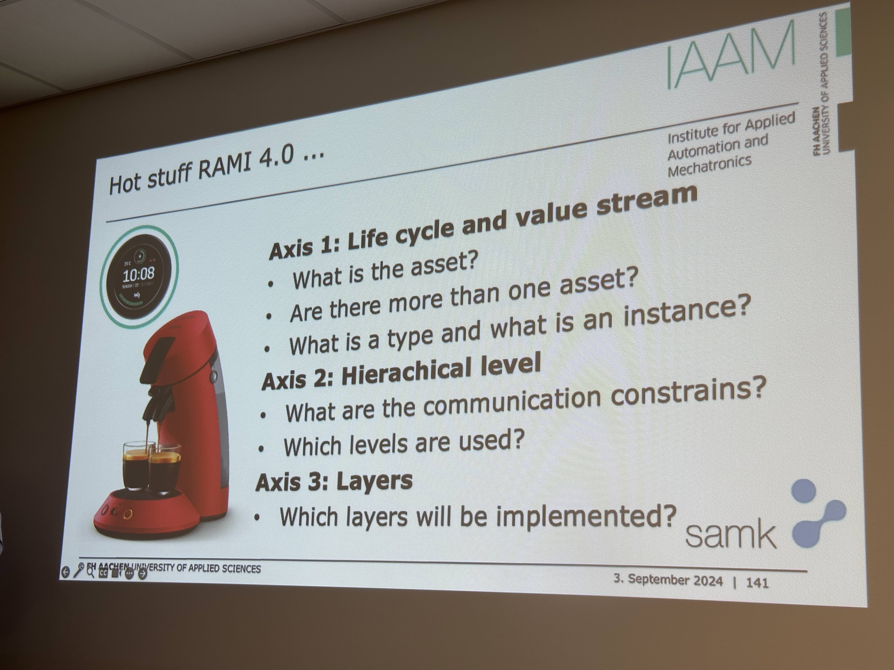

# Industry 4.0 Summerschool in Pori, Finland

## Group C Members

- Dries Nuttin
- Katharina Jäger
- Akshat
- Ben Cloos

## Links:

- [Documentation by FH-Aachen](https://git.fh-aachen.de/lectures-material-wollert/hack-your-coffeemaschine/-/wikis/home)
- [Platform I40 - German Government](https://www.plattform-i40.de/IP/Navigation/EN/Home/home.html)

## Words and stuff

- MES - Management Execution Systems
- ERP - Enterprise Resource Planning 
- ML - Machine Learning
- Agents - Independent Systems that think on their own
- Reinforced Learning - 
- OEE - Overall Equipment Effectiveness = Qual Fact * Perf Fact * Availybility
- Data: just the numbers
- Information: Data + Context
- ...

## Introduction into I4.0

- Vertical integration and networked production systems
- Horizontal integration via value creation networks 
- seamless engineering over the lifecycle / Consistency of the engineering over the entire life cycle

### I4.0 Steps

- Steps:
    - Computerisation
        - Make normal System digital (preparation for i40)
    - Connectivity
        - Add interfaces 
    - Visibility
        - Make Data and process visible, seeable via databases or so
    - Transparency
    - Predictive Capacity
    - Adaptability
    

## Day 2 - RAMI4.0

### RAMI Model

1. Life Cycle and Value Stream - engineering and management of products and production plant over whole lifecycle
1. Hierarchy Levels - Seamles automation from sensors to business
1. Layers - a shell model for a holistical information exchange

### Words

- Asset: may be a lot, from the cup of coffee to the machine
- RAMI4.0: Reference architecture i4.0
- Instance: model created from a type

